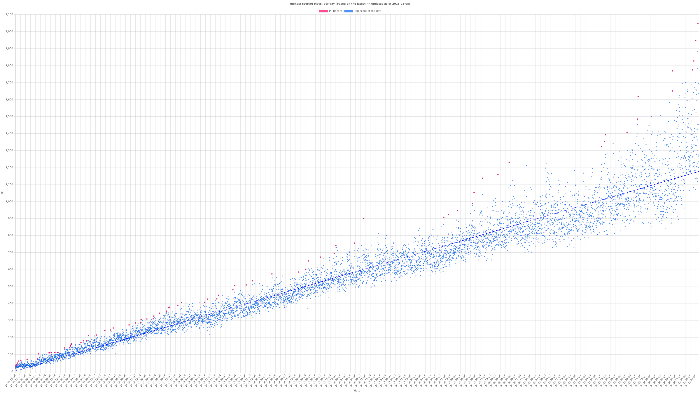

Setup project by executing `npm install`. Data first needs to be scraped by executing `node index.js scrape`. It will take a long time - if you want, you can shorten the call to `sleep` in `scrapeData` (at your own risk).

Once scraping is complete, you can run `node index.js chart`.

Run by installing dependencies and then executing `python3 main.py`.

