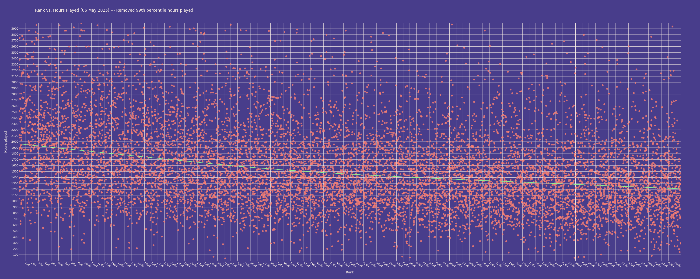

Does not include script for scraping data - `rankings.db` is pulled from a [separate project](https://github.com/mbalsdon/daily-dosu).

Run by installing dependencies and then executing `python3 main.py`.

